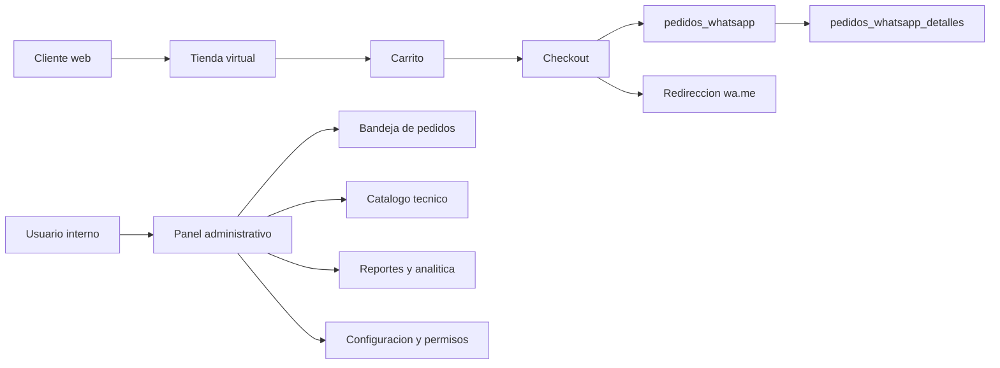
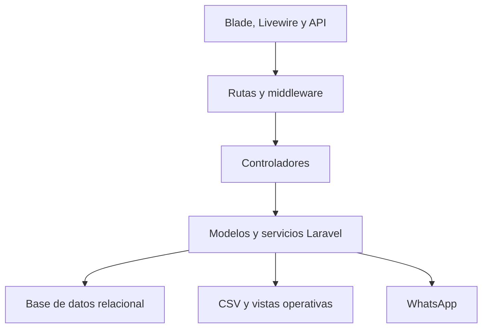
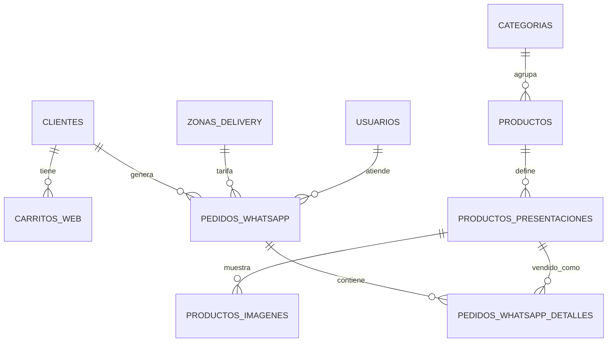
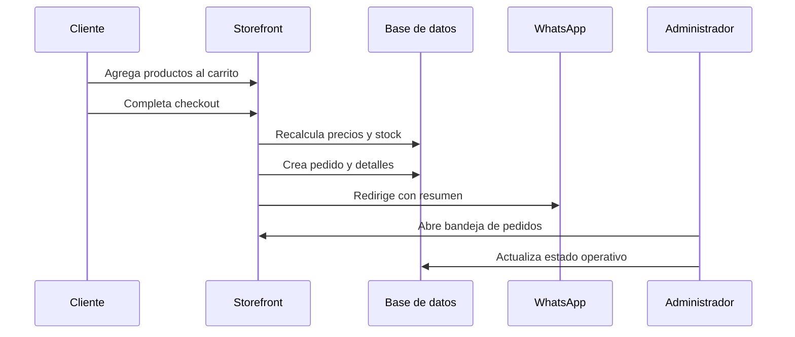

# Arquitectura - Market KM2

Market KM2 usa una arquitectura monolitica modular sobre Laravel 11. La aplicacion se organiza en tres modulos activos:

- `Auth`: administracion, autenticacion, usuarios, roles, permisos, configuracion, reportes y analitica.
- `Inventory`: catalogo tecnico, productos, categorias, presentaciones, imagenes, precios y stock directo.
- `Storefront`: tienda publica, carrito, checkout, pedidos WhatsApp, banners, zonas de delivery y APIs.

No hay modulos activos de POS, reservas, almacenes, compras, caja ni hardware.

## Diagrama General

## Capas

## Modelo De Datos

## Flujo De Pedido

## Rutas Principales

- `/`: tienda publica.
- `/producto/{id}`: detalle de producto.
- `/checkout`: checkout web.
- `/admin/pedidos`: bandeja de pedidos WhatsApp.
- `/admin/productos`: catalogo comercial.
- `/admin/inventory/products`: catalogo tecnico.
- `/admin/reportes`: reportes.
- `/admin/business-data`: analitica.
- `/admin/configuracion`: configuracion.
- `/admin/usuarios`, `/admin/roles`, `/admin/permisos`: seguridad.
