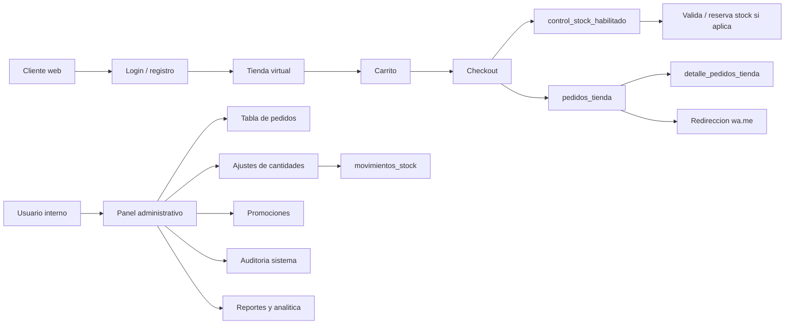
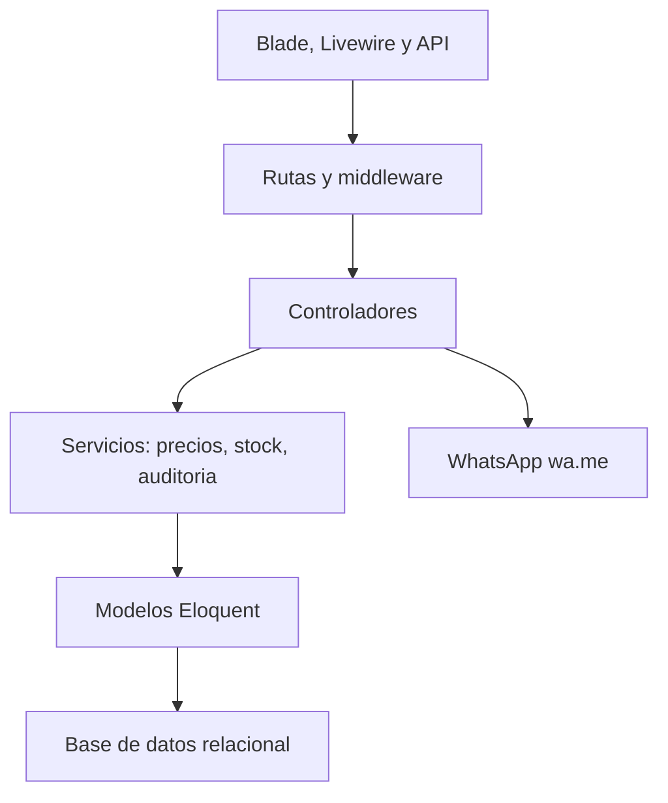
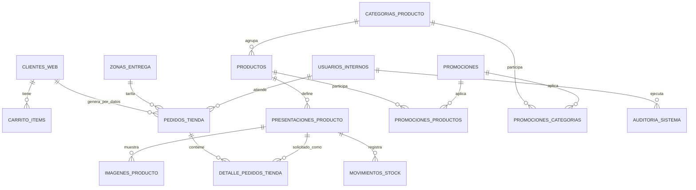
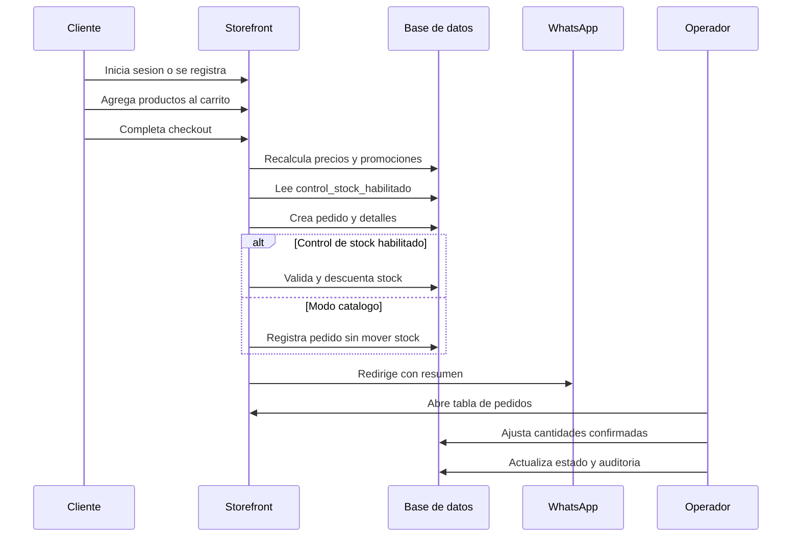

# Arquitectura - Market KM2

Market KM2 usa una arquitectura monolitica modular sobre Laravel 11. La aplicacion se organiza en tres modulos activos:

- `Auth`: administracion, autenticacion interna, usuarios, roles, permisos, configuracion, reportes y analitica.
- `Inventory`: catalogo tecnico, productos, categorias, presentaciones, imagenes, precios, precio referencial y stock.
- `Storefront`: tienda publica, cuenta de cliente, carrito, checkout, pedidos WhatsApp, promociones, banners, zonas de delivery, auditoria y APIs.

No hay modulos activos de POS, reservas, almacenes, compras, caja, SUNAT ni hardware. PECAN queda fuera de integracion y se usa como sistema externo para comprobantes oficiales.
El ticket generado por Market KM2 es operativo y referencial; no reemplaza boleta, factura ni comprobante fiscal.

El sistema mantiene un solo stock por presentacion (`presentaciones_producto.stock`). La configuracion `configuracion_tienda.control_stock_habilitado` determina si el checkout valida y descuenta stock o si la tienda opera como catalogo, permitiendo pedidos con stock cero sin generar movimientos de stock.

## Diagrama General

## Capas

## Modelo De Datos

## Flujo De Pedido

Los detalles del pedido almacenan `cantidad_solicitada` y `cantidad_confirmada`. No se mantiene una tercera cantidad operacional ni un stock separado para evitar duplicidad en la base de datos.

## Rutas Principales

- `/`: tienda publica.
- `/producto/{id}`: detalle de producto.
- `/cliente/login`: ingreso de cliente.
- `/cliente/registro`: registro de cliente.
- `/checkout`: checkout web autenticado como cliente.
- `/admin/pedidos`: tabla operativa de pedidos WhatsApp.
- `/admin/promociones`: gestion de promociones.
- `/admin/auditoria`: auditoria y movimientos de stock.
- `/admin/productos`: catalogo comercial.
- `/admin/inventory/products`: catalogo tecnico.
- `/admin/reportes`: reportes.
- `/admin/business-data`: analitica.
- `/admin/configuracion`: configuracion.
- `/admin/usuarios`, `/admin/roles`, `/admin/permisos`: seguridad.
